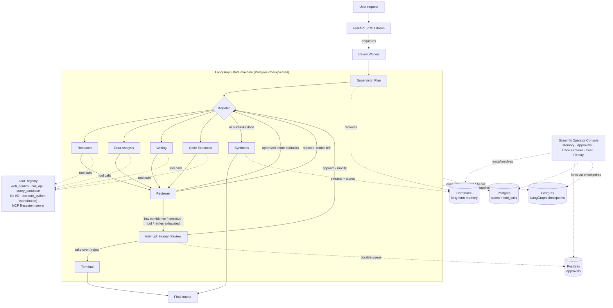

# Agent Orchestration System

A multi-agent orchestration platform: a Supervisor agent decomposes complex tasks, delegates to
specialist tool-using agents, a Reviewer validates output, low-confidence or failed work escalates
to a human, the system remembers what worked across tasks, and every decision is traced end to
end. It's not an AI demo — it's the shape of production infrastructure for autonomous AI
workflows: a supervisor that plans, specialists that act, a reviewer that checks, a human who can
step in, memory that compounds, and full observability into all of it.

**Status: all 6 milestones complete.**

## Architecture



Three layers, matching the original design brief: the **Supervisor** decomposes and plans, four
**Specialists** own a tool-using domain each, and a **Reviewer** validates every deliverable
before it's allowed to count. Around that core: durable human-in-the-loop escalation, long-term
memory that actually informs planning, and a full trace tree for every decision the system makes.

## What works

- **Supervisor** (`src/orchestrator/agents/supervisor.py`) decomposes a request into an ordered,
  dependency-aware `ExecutionPlan` via structured output, with a self-reported confidence score,
  informed by relevant memories from the user's past tasks.
- **Four specialists** (`src/orchestrator/agents/specialists/`) — Research, Data Analysis,
  Writing, Code Execution — share one factory (`agents/specialist_factory.py`) and are each a
  tool-calling agent (via `langchain.agents.create_agent`) scoped to the tools the registry
  allows for that specialist. Outputs from a subtask's dependencies are threaded into the next
  specialist's prompt automatically.
- **Tool registry** (`src/orchestrator/tools/registry.py`) — every tool call is rate-limited
  (Redis fixed-window) and logged (inputs/output/latency/success to Postgres `tool_calls`) and
  traced (OTel span). Tools: keyless DuckDuckGo `web_search`, SSRF-guarded `call_api`,
  read-only-SQL `query_database`, workspace-sandboxed `read_file`/`write_file`, and
  Docker-sandboxed (no network, mem/CPU/time limited, self-building its own pandas/numpy image)
  `execute_python`. Plus MCP-sourced tools (`list_directory`, `directory_tree`, `search_files`,
  `get_file_info`) pulled live from the official `@modelcontextprotocol/server-filesystem`
  reference server over stdio — proving the "custom + MCP" tool framework rather than just one or
  the other.
- **Reviewer** (`src/orchestrator/agents/reviewer.py`) validates each subtask's output against its
  expected format and can reject with feedback, which routes back to the specialist for retry.
- **Persistence**: Postgres (`tasks`, `tool_calls`, `spans`, `approvals`, `memories`, LangGraph
  checkpoints — all Alembic-migrated) + Redis-backed per-task working memory (plan, subtask
  outputs, errors — cleared on completion).
- **Human-in-the-loop** (`src/orchestrator/hitl/`) — real `interrupt()`-based escalation using
  LangGraph's checkpointer, so a paused task survives across process restarts and resumes from a
  *different* process (the API, the Streamlit UI, or the CLI resolver) exactly where it left off.
  Four triggers map to four approval levels: low plan confidence or an explicit review request →
  **Approve Plan**; a specialist using a registry-flagged sensitive tool (e.g. `call_api`) →
  **Approve Action**; a subtask exhausting its retries → **Take Over** (the agent has
  demonstrably failed — hand off directly rather than asking for another approval); any single
  retry that might still succeed → **Notify** (non-blocking, just recorded for visibility). Every
  escalation is a durable Postgres `approvals` row; resolving one calls `Command(resume=...)` on
  the same `thread_id` to continue the graph.
- **Long-term memory** (`src/orchestrator/memory/long_term.py`) — after a task completes, an LLM
  extracts a durable summary (what was asked, what approach worked, tools used, facts discovered,
  preferences observed), embeds it, and stores it in ChromaDB with a mirrored Postgres `memories`
  row for importance tracking. Retrieval itself counts as "access" — bumping importance.
  `memory/importance.py` applies time-based decay + expiration and consolidates near-duplicate
  memories via LLM summarization (a Celery-beat job in production; run manually via
  `scripts/run_memory_maintenance.py` here).
- **Observability** (`src/orchestrator/observability/`) — real OpenTelemetry spans (a
  `TracerProvider` with a custom `PostgresSpanExporter`, so every span is both genuinely OTel and
  immediately queryable without standing up Jaeger) wrap every agent node, tool call, and LLM
  call into one unified trace tree per task. LLM usage/cost is captured via a LangChain callback
  attached at chat-model construction time, priced against a per-model table.
- **API + async execution**: FastAPI (`src/api/`) exposes task submission/status, approval
  resolution, memory management, and trace/cost queries; Celery provides the async,
  horizontally-scalable execution layer — `POST /tasks` enqueues a worker task that runs the full
  LangGraph invocation. (Parallelism *within* a task is LangGraph's own concern, not nested Celery
  tasks — see "Honest simplifications" below.)
- **Streamlit Operator Console** (`src/ui/`), five pages: **Memory Dashboard** (what the system
  remembers about a user, delete-on-request), **Approval Queue** (full context per escalation,
  relevant memories, an ask-a-clarifying-question box, and approve/modify/reject/take-over),
  **Trace Explorer** (the tree, color-coded, full prompt/response/cost detail per span), **Cost
  Dashboard** (spend by model/node, tool usage, escalation rate), **Replay** (steps through a
  task's checkpoint history and forks from any step with a modified field — LangGraph's own
  time-travel primitive, not a bespoke replay engine).

## Running it

### Full stack (Docker)

```bash
cp .env.example .env   # fill in OPENAI_API_KEY
docker compose up -d --build
```

- API: `http://localhost:8000` (`/health`, `/tasks`, `/approvals`, `/memory/{user_id}`, `/traces/{task_id}`, `/costs/summary`)
- Operator console: `http://localhost:8501`
- Migrations run automatically on API container startup.

```bash
curl -X POST http://localhost:8000/tasks -H "Content-Type: application/json" \
  -d '{"user_request": "Write a short report comparing LangGraph and a plain LangChain AgentExecutor.", "user_id": "demo-user"}'
curl http://localhost:8000/tasks/<task_id>
```

### Local dev (no Docker for the app itself)

```bash
python -m venv .venv
.venv/Scripts/pip install -e ".[dev]"
cp .env.example .env   # fill in OPENAI_API_KEY; adjust DATABASE_URL port if 5432 is already in use
docker compose up -d postgres redis chromadb
alembic upgrade head
python scripts/run_task.py "Write a short report comparing LangGraph and a plain LangChain AgentExecutor." my-user-id --force-review
streamlit run src/ui/review_app.py

# if a task pauses for human review, resolve it via the UI or:
python scripts/resolve_approval.py <task_id> approve
```

### Demo script

```bash
python scripts/demo.py
```

Runs a multi-specialist research task end to end, then a related follow-up for the same user with
`--force-review` — showing memory from the first task informing the second plan, and a
human-in-the-loop approval pause that the script resolves itself (playing the human), the same
way the Approval Queue does. Finishes with a trace/cost summary; open the Streamlit UI to inspect
both tasks visually.

## Testing

```bash
pytest tests/unit -q    # pure-logic + mocked-boundary tests
pytest tests/e2e -q     # live tests against a real OpenAI key + Postgres/Redis/Chroma
```

E2E coverage: task decomposition produces a valid DAG; a specialist correctly uses its tools; the
reviewer rejects bad output and approves good output; memory retrieval surfaces a relevant past
task and stays user-scoped; `force_review` reliably triggers the plan-approval escalation; a
specialist that fails repeatedly escalates to a human instead of crashing the run.

## Honest simplifications

- Celery provides top-level async execution, not per-specialist task queuing — LangGraph handles
  parallelism *within* a task via its own graph structure. A deliberate architecture choice, not
  an oversight.
- Web search uses free DuckDuckGo instead of a paid provider — swappable via the tool registry
  without touching any specialist.
- Human "Notify" surfaces in the Streamlit queue / API only; no Slack/email integration.
- Memory decay/consolidation runs on demand (`scripts/run_memory_maintenance.py`) rather than on
  a live Celery-beat schedule — the logic is identical either way, only the trigger differs.

## Roadmap

1. ✅ Core agent graph (Supervisor / specialists / Reviewer, LangGraph state machine)
2. ✅ Tool registry (custom + MCP) + all 4 specialists + Postgres/Redis persistence
3. ✅ Long-term semantic memory (ChromaDB) + retrieval-augmented planning + Memory Dashboard
4. ✅ Human-in-the-loop: interrupt()-based escalation + approval levels + Approval Queue UI
5. ✅ OpenTelemetry tracing + Trace Explorer + Cost Dashboard + checkpoint-based Replay
6. ✅ FastAPI + Celery, full Docker Compose stack, end-to-end tests, demo script
